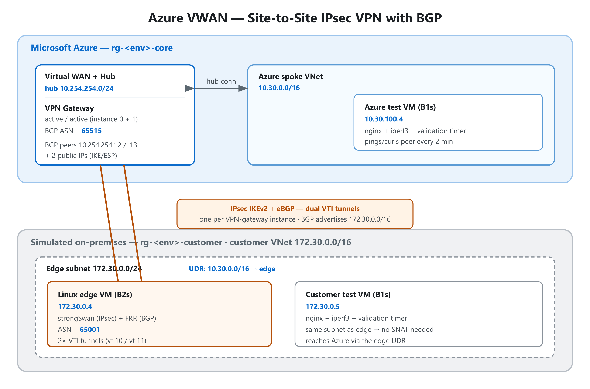

# Azure VWAN BGP Lab

A fully automated [Azure Developer CLI](https://learn.microsoft.com/azure/developer/azure-developer-cli/) (`azd`) template that stands up an **Azure Virtual WAN site-to-site IPsec VPN with BGP peering** against a simulated on-premises edge — a Linux VM running **strongSwan + FRR**. A small test VM on each side continuously validates Layer 3/4 connectivity across the tunnel.

**No nested virtualization. No portal clicks.** `azd up` to deploy, `azd down` to destroy.

## Architecture



Two resource groups are created in a single subscription-scoped deployment:

| | `rg-<env>-core` (Azure) | `rg-<env>-customer` (simulated on-prem) |
| --- | --- | --- |
| **Network** | VWAN + Virtual Hub `10.254.254.0/24`, spoke VNet `10.30.0.0/16` | VNet `172.30.0.0/16`, edge subnet `172.30.0.0/24` |
| **Gateway / edge** | VPN Gateway (active/active), BGP **ASN 65515** | Linux edge VM `172.30.0.4` — strongSwan + FRR, BGP **ASN 65001** |
| **Test workload** | Azure test VM `10.30.100.4` | Customer test VM `172.30.0.5` (in the edge subnet) |

The two BGP ASNs differ on purpose — this is **eBGP**. The customer ASN is configurable via `LOCAL_ASN`; the Azure side is fixed at 65515.

### How it stays automatic

`infra/modules/vpngateway.bicep` exports Azure's assigned BGP/tunnel addresses (`bgpSettings.bgpPeeringAddresses[*]`) as Bicep **outputs**. `main.bicep` injects those into `infra/cloud-init/edge.yaml.tmpl` via `loadTextContent` + `replace()` and base64-encodes the result into the edge VM's `customData`. On first boot the edge:

1. Installs `strongswan`, `frr`, `iperf3`.
2. Creates two VTI interfaces (`vti10`, `vti11`) — one per Azure VPN-gateway instance.
3. Brings up IPsec against both Azure tunnel public IPs.
4. Starts two eBGP sessions and advertises `172.30.0.0/16`.

The customer test VM lives **in the edge subnet** with a UDR steering `10.30.0.0/16` to the edge. Azure SDN delivers NVA-forwarded, foreign-source packets only *within the same subnet*, so co-locating the test VM avoids any need for SNAT.

## Prerequisites

- [Azure Developer CLI](https://learn.microsoft.com/azure/developer/azure-developer-cli/install-azd) (`azd version` >= 1.5)
- [Azure CLI](https://learn.microsoft.com/cli/azure/install-azure-cli) (used by the post-provision validation hints)
- An SSH public key (e.g. `~/.ssh/id_ed25519.pub`)
- An Azure subscription you can create VWAN + VPN gateways in

## Deploy

Run from the repository root (where `azure.yaml` lives).

```powershell
# One-time: create an environment and set required values
azd env new vwanbgp-dev                              # any name
azd env set SSH_PUBLIC_KEY "$((Get-Content $HOME\.ssh\id_ed25519.pub -Raw).Trim())"
azd env set VPN_SHARED_KEY (-join ((48..57)+(65..90)+(97..122) | Get-Random -Count 32 | % {[char]$_}))

# Optional overrides
azd env set SSH_SOURCE_PREFIX "203.0.113.42/32"      # tighten SSH (default: *)
azd env set ADMIN_USERNAME    "azureuser"
azd env set LOCAL_ASN         "65001"

# Provision (azd prompts for region/subscription on first run)
azd up
```

Bash equivalent:

```bash
azd env new vwanbgp-dev
azd env set SSH_PUBLIC_KEY "$(cat ~/.ssh/id_ed25519.pub)"
azd env set VPN_SHARED_KEY "$(openssl rand -base64 32)"
azd up
```

Expect **~25–35 min** — the VWAN VPN gateway is the long pole. After provisioning, BGP needs another **1–3 min** to converge before the test VMs report success.

### Configuration

**Required** (`azd env set ...`):

| Name | Description |
| --- | --- |
| `SSH_PUBLIC_KEY` | Single-line OpenSSH public key for all Linux VMs |
| `VPN_SHARED_KEY` | IPsec PSK (any 16+ char string) |

**Optional:**

| Name | Default | Description |
| --- | --- | --- |
| `SSH_SOURCE_PREFIX` | `*` | CIDR allowed to SSH to the edge VM |
| `ADMIN_USERNAME` | `azureuser` | Linux admin user |
| `LOCAL_ASN` | `65001` | Customer-side BGP ASN |

**Outputs** written to `.azure/<env>/.env` include `CORE_RESOURCE_GROUP`, `CUSTOMER_RESOURCE_GROUP`, `EDGE_VM_NAME`, `AZURE_TEST_VM_NAME`, `CUSTOMER_TEST_VM_NAME`, the gateway BGP/tunnel IPs, and a ready-to-run `VALIDATION_COMMAND`.

## Testing / validation

Both test VMs run a systemd timer every 2 minutes that pings, curls, and iperf3s the peer across the tunnel, logging to `/var/log/s2s-validation.log`.

**Tail the Azure-side test VM log** (the `VALIDATION_COMMAND` output runs exactly this):

```powershell
az vm run-command invoke `
  -g (azd env get-value CORE_RESOURCE_GROUP) `
  -n (azd env get-value AZURE_TEST_VM_NAME) `
  --command-id RunShellScript `
  --scripts "tail -n 80 /var/log/s2s-validation.log"
```

You should see ping/HTTP/iperf3 succeeding to `172.30.0.5`. Run the same against `CUSTOMER_TEST_VM_NAME` in `CUSTOMER_RESOURCE_GROUP` for the reverse direction.

**Check IPsec + BGP on the edge appliance:**

```powershell
az vm run-command invoke `
  -g (azd env get-value CUSTOMER_RESOURCE_GROUP) `
  -n (azd env get-value EDGE_VM_NAME) `
  --command-id RunShellScript `
  --scripts "ipsec status; echo ---; vtysh -c 'show ip bgp summary'"
```

Healthy state: **2 tunnels INSTALLED** and **both BGP peers Established** (an uptime, not `Connect`), each learning `172.30.0.0/16`. In the portal, the VWAN hub's **VPN (Site to site) → BGP Dashboard** shows the two connected peers.

> **Build/lint only** (no deploy): `az bicep build --file infra/main.bicep`.

## Tear down

```powershell
azd down --purge --force
```

`azd down` finds every resource by its `azd-env-name` tag and deletes **both** resource groups in parallel. Allow ~40 min — VPN gateway deletion dominates.

## Cost

Dominant cost is the VWAN VPN gateway scale unit (~$0.40/hr) plus the VWAN hub (~$0.25/hr). The VMs (B1s × 2 + B2s × 1) are pennies. Run `azd down` between sessions.

## Repository layout

```
.
├── README.md
├── azure.yaml                              # azd entry point
├── docs/
│   └── architecture.(svg|png)              # the diagram above
└── infra/
    ├── main.bicep                          # subscription-scope deployment
    ├── main.parameters.json                # azd env-var bindings
    ├── cloud-init/
    │   ├── edge.yaml.tmpl                  # strongSwan + FRR config
    │   └── testvm.yaml.tmpl                # iperf3/nginx + validation timer
    └── modules/
        ├── publicip.bicep
        ├── virtualwan.bicep
        ├── virtualhub.bicep
        ├── vhubconnection.bicep
        ├── vpngateway.bicep                # exposes Azure BGP IPs as outputs
        ├── vpnsite.bicep
        ├── vpnsiteconnection.bicep
        ├── routetable.bicep
        ├── vnet.bicep
        ├── linuxedge.bicep                 # B2s edge VM (strongSwan + FRR)
        └── testvm.bicep                    # B1s test VM
```

## Notes / caveats

- The edge VM has a public IP open on UDP/500, UDP/4500, and ESP from the Internet — required for VWAN to reach it. SSH defaults to `*` for lab convenience; tighten `SSH_SOURCE_PREFIX` for anything real.
- The PSK is interpolated into the VM's `customData`. ARM stores `customData` per VM; treat it as data, not a secret. For production hygiene, swap to a Key Vault reference read via the VM's managed identity.
- FRR advertises only `172.30.0.0/16`. To advertise more networks or change IPsec parameters, edit `infra/cloud-init/edge.yaml.tmpl` (the `__UPPER_SNAKE__` placeholders), not the rendered output.
- `dependsOn` entries that the Bicep linter flags as unnecessary may still be required for correct ordering — don't remove them blindly.
